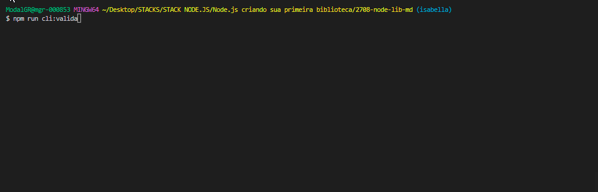

# PROJETO LEITOR DE TEXTO 

Nesse projeto temos alguns arquivos de texto salvos na pasta de arquivos. O intuito dessa aplicação é pegar o caminho dessa pasta de forma dinâmica a partir de funções javascript e exibir os dados que queremos. Usamos também a biblioteca Chalk, para 
exibir os resultados no terminal com uma cor personalizada. 

